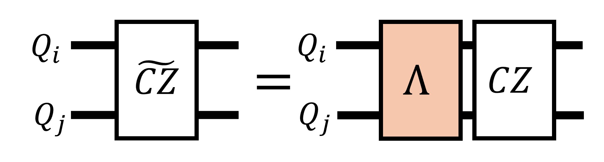
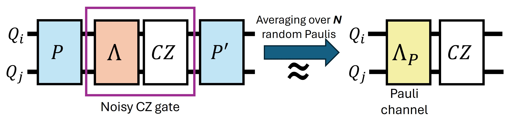
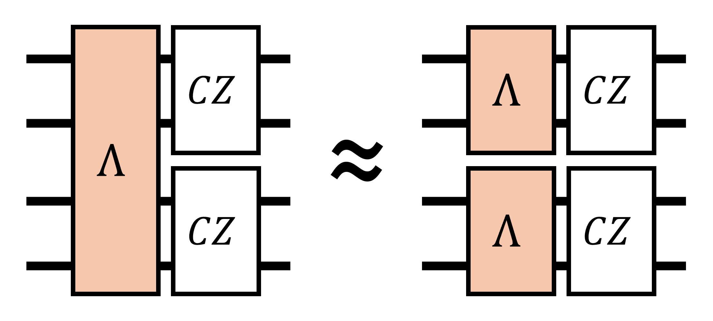
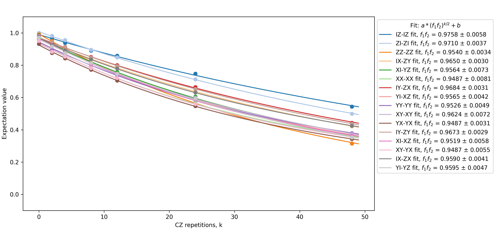
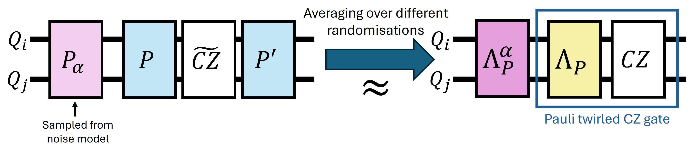
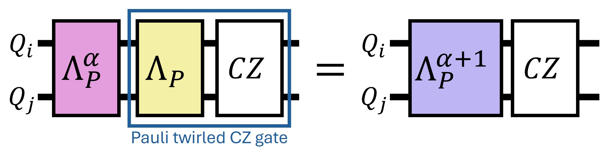
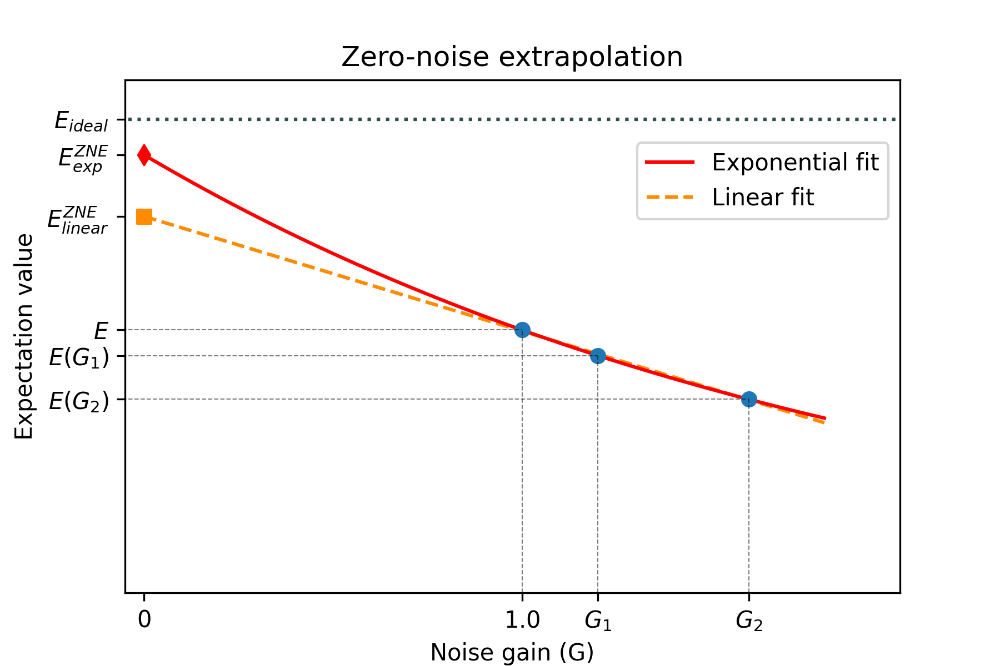

# QuantumInspireUtilities
This repository contains utility functions and demonstration notebooks that supplement the [Quantum Inspire 2.0](https://www.quantum-inspire.com/) Python SDK, tailored for the superconducting backends of the platform, hosted in the [DiCarlo lab](https://qutech.nl/lab/dicarlo-lab-welcome/) in QuTech.

It is primarily intended for researchers, students, and developers who use Quantum Inspire’s superconducting backends and want reusable utilities and worked examples beyond the core SDK.

Useful links relating to our superconducting backends:
1. [Tuna Backends Operational Specifics](https://www.quantum-inspire.com/kbase/tuna-operational-specifics/)
2. [Backend Performance Dashboards](https://monitoring.qutech.support/public-dashboards/c494a21fb6b7405f850ab8f340f798ef?orgId=1&refresh=10s) [live updates]
3. [Join our Slack community!](https://join.slack.com/t/qisuperconducting/shared_invite/zt-35o7zitdh-_9QPmB53hhLy12Eat5gwWA)

## 1. Installation instructions

### 1.1. Beginner-friendly installation
Note: this installation method is typically not recommended, but is nevertheless suggested due to its relative simplicity. In principle it avoids installing and using pipx, which some users have experienced difficulties in doing so.

1. [Install Anaconda](https://www.anaconda.com/) or Miniconda (lightweight version of Anaconda) in your computer
2. Open Anaconda Prompt (or Terminal in UNIX)
3. Run the following commands
- conda create -n quantuminspire python=3.12  (creates a new conda environment)
- conda activate quantuminspire  (activates the environment)
- pip install quantuminspire
- pip install qi-utilities (installs this repository)
- pip install jupyterlab
- pip install notebook

Installing quantuminspire within the conda environment restricts the command 'qi login' to be recognized and used only within the created environment.

### 1.2. Advanced installation (recommended)

1. [Install pipx](https://pipx.pypa.io/stable/installation/) (used when installing quantuminspire package)
2. [Install quantuminspire repository](https://github.com/QuTech-Delft/quantuminspire?tab=readme-ov-file) (used for login)
3. [Install Anaconda](https://www.anaconda.com/) or Miniconda (lightweight version of Anaconda) in your computer
4. Open Anaconda Prompt (or Terminal in UNIX)
5. Run the following commands
- conda create -n quantuminspire python=3.12  (creates a new conda environment)
- conda activate quantuminspire  (activates the environment)
- pip install qi-utilities (installs this repository)
- pip install jupyterlab
- pip install notebook

Note: in order to run the method backend.coupling_map.draw(), you will need to [install Graphviz](https://graphviz.org/download/#executable-packages) in your computer. Make sure during installation to add Graphviz to the system PATH, so that your Python environment can recognize it.

## 2. Using the notebook guides (requires cloning the repository)

In order to use the Jupyter notebook guides which include from simple example code up to advanced demonstrations, you will need to clone this repository. First, you will need a GitHub account to be able to pull the project.

For new users, we recommend downloading [GitHub Desktop](https://desktop.github.com/download/), and then cloning the repository by using the link https://github.com/DiCarloLab-Delft/QuantumInspireUtilities.git.

After creating a working Python environment (see instructions above) and having cloned the repository, you should be able to use the notebooks.

In order to create your first quantum circuit using the Quantum Inspire SDK, visit https://qutech-delft.github.io/qiskit-quantuminspire/getting_started/submitting.html.

## 3. Error mitigation module
This module contains utility functions enabling quantum error mitigation using the zero-noise extrapolation (ZNE) technique on the superconducting backends of Quantum Inspire. These tools focus on the CZ gate, as this is the only native 2-qubit gate of the Tuna backends, but they can in principle be used for any other kind of two-qubit gate on any hardware.

The module contains the following tools for performing error mitigation, (along with their section in the tutorial).
1. Pauli twirling (Sec. 3 of the [user tutorial](qi_utilities/notebook_guides/2.0_error_mitigation.ipynb))
2. Noise learning for CZ gates (Sec. 4 of the [user tutorial](qi_utilities/notebook_guides/2.0_error_mitigation.ipynb))
3. Probabilistic error amplification (PEA) (Sec. 5 of the [user tutorial](qi_utilities/notebook_guides/2.0_error_mitigation.ipynb))
4. Zero-noise extrapolation (ZNE) (Sec. 5 of the [user tutorial](qi_utilities/notebook_guides/2.0_error_mitigation.ipynb))

### 3.1. Pauli twirling

We describe a noisy CZ gate $\widetilde{\mathrm{CZ}}$ as a general noise channel $\Lambda$ acting before an ideal CZ operation.

    

Pauli twirling is used to approximate the general channel $\Lambda$ with a stochastic Pauli error channel $\Lambda_P$, which is diagonal in the Pauli basis. A random two-qubit Pauli $P$ is applied before the CZ gate, and to preserve the ideal action of the circuit, its conjugate $P^\prime = \mathrm{CZ}\ P\ \mathrm{CZ}^\dagger$ is applied after the CZ gate. Averaging over different randomizations diagonalizes the noise channel, such that when acting on Pauli operators it only applies a multiplicative factor $f_i$ called the Pauli fidelity,

$$
\Lambda_P(P_i) = f_i P_i,
$$

where $\Lambda_P$ is the Pauli channel and $P_i$ the two-qubit Pauli operator.

    

### 3.2. Learning the noise of a CZ gate
The noise learning tools closely follow the procedure shown by [van den Berg, E., Minev, Z.K., Kandala, A. et al (2023)](https://doi.org/10.1038/s41567-023-02042-2), with the exception that we assume that when multiple CZ gates are performed in parallel, the noise channel can be approximated as multiple two-qubit noise channels acting on the individual CZ gates (assumes no or low CZ crosstalk).

    

The first step in the noise learning procedure is to learn the Pauli fidelities of the twirled noise channel $\Lambda_P$. We execute circuits containing a varying number of CZ gate repetitions, and fit exponential decays to the obtained expectation values, in order to extract the Pauli fidelities. However, using this technique one can only learn multiplicative pairs of Pauli fidelities for the CZ gate.

    

We use the symmetry condition assumption used by [van den Berg, E., Minev, Z.K., Kandala, A. et al (2023)](https://doi.org/10.1038/s41567-023-02042-2) to solve the issue of the occuring pairs of Pauli fidelities: the two fidelities that appear in each pair are treated as equal. Finally we can fit the noise model and obtain the Pauli error rates ($\lambda_i$).

### 3.3. Probabilistic error amplification (PEA)
The noise amplification closely follows the procedure shown by [Kim, Y., Eddins, A., Anand, S. et al (2023)](https://doi.org/10.1038/s41586-023-06096-3).
We can selectively amplify the effective noise of a CZ gate once we have learned its twirled noise $\Lambda_P$. We sample errors from the noise model and apply them before the (Pauli twirled) CZ gate. Averaging over different randomizations adds an additional Pauli channel $\Lambda_P$ in front of the CZ gate with an appropriate scale factor $\alpha$, resulting in an effective noise gain of $G=\alpha+1$.

    

    

### 3.4. Zero-noise extrapolation (ZNE)
Once we have executed a circuit at multiple different noise gains $G$, we can use ZNE to get a noise mitigated estimate of the expectation values $E^{\text{ZNE}}$. We perform a fit (linear or exponential) on the measured expectation values $E(G)$; by extrapolating this fit to $G=0$ we get the noise-mitigated estimate of the expectation value.

    

## 4. TODOs
[2026-01-20] Current list of targeted upcoming new features:

* Create utility functions and a demonstration notebook guide on variational quantum algorithms.
